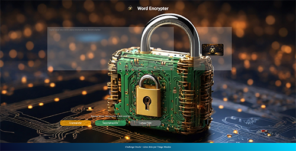

# Desafio Challenge Oracle + Alura

## Nesse Desafio foram utilizadas as seguintes tecnologias

    
    
    

## Screeshoot do projeto

## Para executar o programa 

### Vocêpode acessar a página no githubpages no link: <a href="https://thiagotmdev.github.io/Challenge-Criptografia-Oracle-Alura/" target="__blank">Page</a>

## Ou

### Clique 2 vezes no arquivo index, ele vai abrir no seu navegador, digite em letrasminúsculas sem acento no campo, esquerdo e depois clique no botão Criptografar e do lado direito ira aparecer sua mensagem criptografada.

### Para descriptografar coloque sua mensagem criptografada no campo direito e clique no botão descriptografar.

###  Para ambos os casos irá aparecer o botão copiar, clicando nele irá copiar o conteudo do campo direito, para a sua área de transferência, e você pode colar onde quiser.

### Sequiser limpar os campos para digitar novamente é só clicar no botão limpar tela.